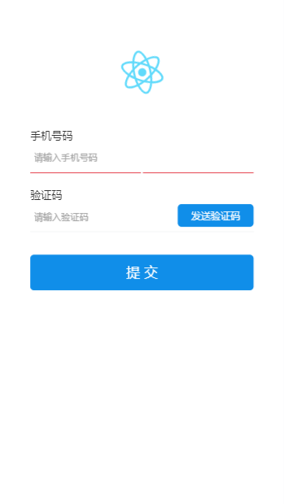
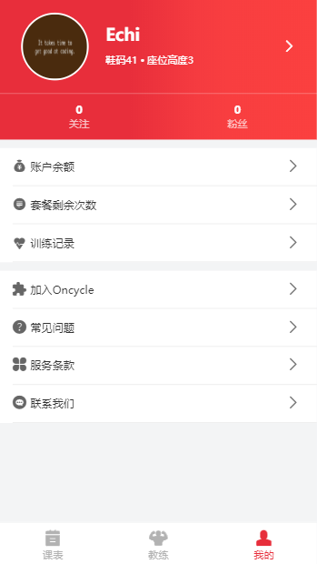
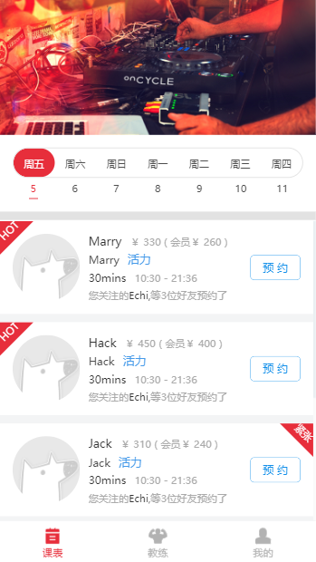

<h1 align="center">开发须知</h1>

## 技术栈及使用要求
> 1. 基于React + React-router-dom + redux + React-redux + React-redux-router + Typescript + Webpack4构建的企业级应用项目;
> 2. 开发时请确保你已了解或掌握以上技术要求,然后你就可以愉快的玩耍了;

## 从新建项目到设置打包环境
```
1. create-react-app my-app
3. 新建各个环境的文件，例如：.env.development .env.production
4. 在 package.json 中设置打包命令，例如：build:development build:test build:production，在执行命令的语句中设置 mode 环境，例如：--mode test
```

## 关于环境变量的注意事项
* 环境名应该与环境文件统一
* 环境文件放置根目录下
* 除了 `PUBLIC_URL` 和 `NODE_ENV` 其他环境变量使用 `REACT_APP_` 开头
* 另外还设定本地运行环境`local`,你可以在项目拉取下来后补充 `.env.development.local` 文件,并添加如下信息并替换你自己所在服务器的域名及端口;
例如 :
    NODE_ENV='development'
    REACT_APP_URL='http://localhost:8080'  

## 生命周期

```
class Content extends React.Component {
   componentWillMount() {
      console.log('Component WILL MOUNT!')
   }
   componentDidMount() {
      console.log('Component DID MOUNT!')
   }
   componentWillReceiveProps(newProps) {
      console.log('Component WILL RECEIVE PROPS!')
   }
   shouldComponentUpdate(newProps, newState) {
      return true;
   }
   componentWillUpdate(nextProps, nextState) {
      console.log('Component WILL UPDATE!');
   }
   componentDidUpdate(prevProps, prevState) {
      console.log('Component DID UPDATE!')
   }
   componentWillUnmount() {
      console.log('Component WILL UNMOUNT!')
   }
   render() {
      return (
         <div>
            <h3>{this.props.myNumber}</h3>
         </div>
      );
   }
}
```

## 工程目录结构
```bash
src：项目源码。开发的时候代码写在这里。
 |--assets # 项目静态文件
    |--images # 图片
    |--style # css样式
 |--router # 项目路由
 |--views # 项目应用页面，根据应用需要，还可以有子页面，各子页面目录结构和顶级子页面类似
    |--App # 主视图
    |--Exception # 错误页面
    |--Login # 登录页面
 |--index.tsx # 项目入口文件

 ```

## 使用

### 使用命令行
```bash
$ git clone git@github.com:Echi1993/react-ts-client.git
$ cd react-ts-client
$ yarn install
$ yarn start         # 访问 http://localhost:3000
$ yarn build         # Compiles and minifies for production
```

## 部分界面

<div align="center">
   <p>登录界面</p>
   
   <p>个人信息</p>
   
   <p>课表页面</p>
   
</div>


> 开发历程

#### 2019-3-18 项目初始化，使用TSLint规范代码
  - 使用React框架搭建Typescript基础工程
  - 创建项目实例代码,生成基础的文件

#### 2019-3-20 新增登录界面
  - 添加登录页面
  - 添加登录接口

#### 2019-3-23 新增登录界面
  - 添加个人中心页面
  - 添加获取个人信息接口
  - 添加修改个人信息界面
  - 添加修改个人信息接口

#### 2019-3-27 新增登录界面
  - 添加图片转换base64上传

#### 2019-3-31 新增课程表页面
  - 添加课程表页面
  - 获取课程表数据接口


## 支持环境

现代浏览器及 IE11。

| [](http://godban.github.io/browsers-support-badges/)</br>IE / Edge | [](http://godban.github.io/browsers-support-badges/)</br>Firefox | [](http://godban.github.io/browsers-support-badges/)</br>Chrome | [](http://godban.github.io/browsers-support-badges/)</br>Safari | [](http://godban.github.io/browsers-support-badges/)</br>Opera |
| --------- | --------- | --------- | --------- | --------- |
| IE11, Edge| last 2 versions| last 2 versions| last 2 versions| last 2 versions